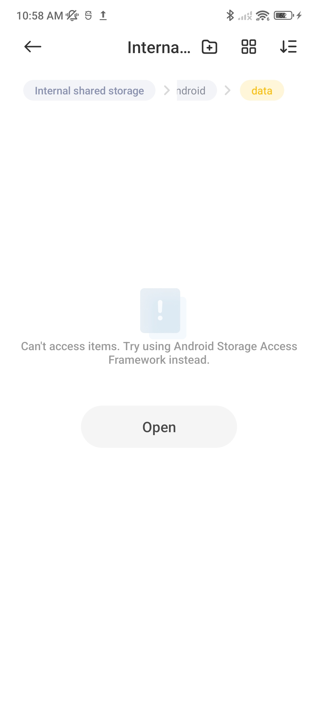

# Ultrasound-Data-Collection
This repo is the full source of ultrasound data collection. You can check the process and download app A3. Thanks to every volunteer!

## Note & Privacy Policy
1. The application is used to capture lossless speech signals.
2. The output format is WAV/PCM, which the former can be playable on the device.
3. On the input box, you can fill in your nickname or candidate ID as the prefix of the output file, if approvable.
4. (ATTENTION!!) The default storage path is the built-in storage path of the application. DO NOT uninstall the application without data backup.
5. If failure, please check whether the dir exists: /storage/emulated/0/Android/data/com.app.audio.record/
6. (IMPORTANT!!) We only collect your speech information for research and will not use it for any other purposes involving privacy. Once you press AGREE, it means you agree to the Privacy Policy.
7. Feel free to contact me by E-mail: jiangtyu2001@gmail.com / GitHub: @chiangtau.

## Installation
1. Install the application namely *ultrasound data collection*.
2. Create the folder: /storage/emulated/0/Android/data/com.app.audio.record/
**Some devices can not access items. Please use Android Storage Access Framework instead. (Based on REDMI K40)**

