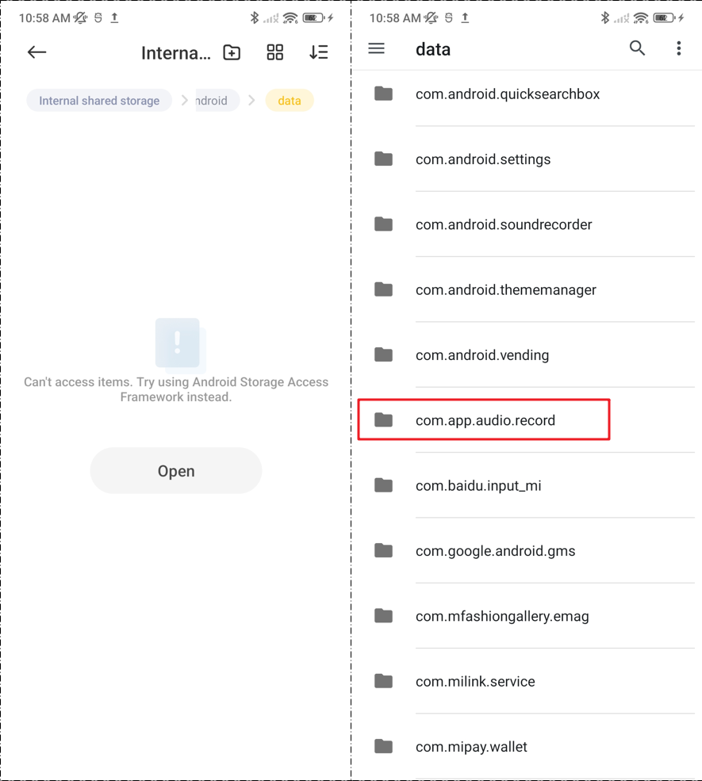
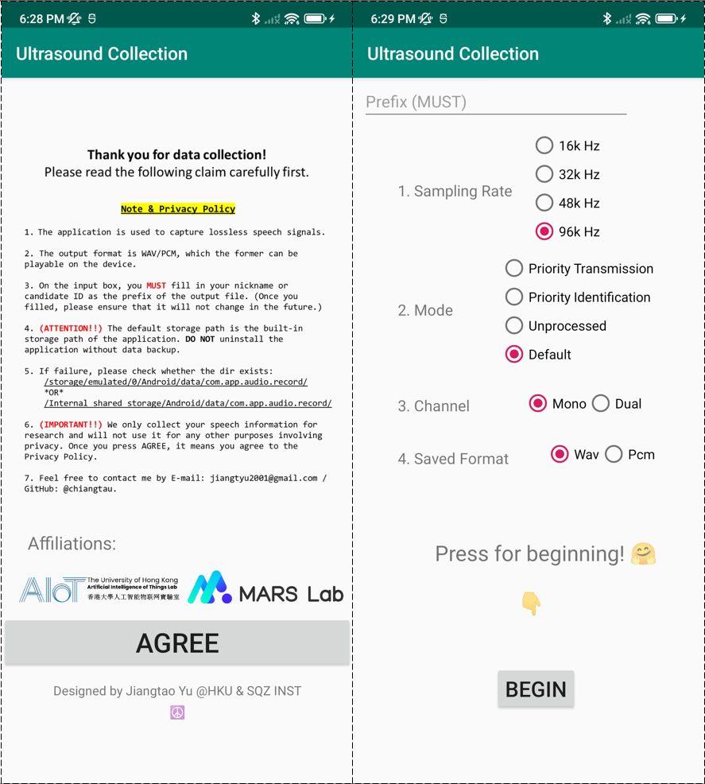

# Ultrasound-Data-Collection
This repo is the full source of ultrasound data collection. You can check the process and download app A3. Thanks to every volunteer!

## Note & Privacy Policy
1. The application is used to capture lossless speech signals.
2. The output format is WAV/PCM, which the former can be playable on the device.
3. On the input box, you **<font color=red>MUST</font>** fill in your nickname or candidate ID as the prefix of the output file. (Once you filled, please ensure that it will not change in the future.)
4. **<font color=red>(ATTENTION!!)</font>** The default storage path is the built-in storage path of the application. DO NOT uninstall the application without data backup.
5. If failure, please check whether the dir exists: 
    ```
    /storage/emulated/0/Android/data/com.app.audio.record/ 

    *OR*   

    /Internal shared storage/Android/data/com.app.audio.record/
    ```
6. **<font color=red>(IMPORTANT!!)</font>** We only collect your speech information for research and will not use it for any other purposes involving privacy. Once you press AGREE, it means you agree to the Privacy Policy.
7. Feel free to contact me by E-mail: jiangtyu2001@gmail.com / GitHub: @chiangtau.

## Installation & Process
1. Install the application namely *ultrasound data collection*.   
2. Create the folder: 
    ```
    /storage/emulated/0/Android/data/com.app.audio.record/ 

    *OR*   

    /Internal shared storage/Android/data/com.app.audio.record/
    ```  


    >**_NB._ Some devices can not access items. Please use Android Storage Access Framework instead. (Based on REDMI K40)**

3. Click [here](https://drive.google.com/file/d/141sxAD5RbwJLw03GR1_Ll0HJ6TPBOFYz/view?usp=sharing) to download the sensing waveform.
4. Play 'waveform.wav' before collection. The proper volume is **~75%** (From a 5 cm away microphone, the measured loudness is **~70dB**).
5. <font color=red>(IMPORTANT!!)</font> Default settings of applications: Sampling Rate = 96k Hz, Mode = Default, Channel = Mono, Saved format = Wav. Do not change if no specific requirements.
6. Open the app, you can see these 2 layers. Press AGREE -> Fill in the Prefix -> Choose the settings -> Press BEGIN.

7. After your recording, you can close the sensing waveform and application.

## Recording Requirements
### Clean Dataset
1. Do not record data in noisy environments.
2. During data recording, please do not shake your phone and head violently. Please keep no obstacles between the phone and your mouth.
3. It is not necessary to control the speaking volume, the distance between the mouth and the bottom microphone, within 20cm, but please keep the two at the same level.
4. We highly recommend that you speak out and record the materials listed. English better.
Materials Link: [TIMIT](https://catalog.ldc.upenn.edu/docs/LDC93S1/PROMPTS.TXT)
Example:   


### Other Dataset
TBD


Thanks for this [repo](https://github.com/979451341/Audio-and-video-learning-materials).